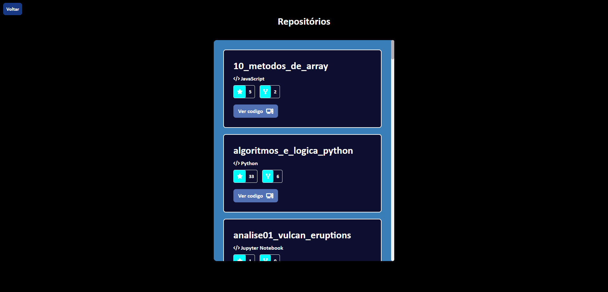

<h1 align="center">
    Busque usuarios e seus repositorios
</h1>

  

  

## 🚀 Tecnologias

- HTML
- CSS
- JavaScript
- GIT API

## 💻 Descrição

Aplicação que permite buscar um usuario no github e fornecer suas informações, como numero de seguidores, localização, e repositorios. Consumindo Github API para o providenciamento de dados.
